# match(it): A lightweight header-only pattern-matching library for C++17 with macro-free APIs.



## In this page, we will give equivalent sample codes for samples from the [C++ Pattern Matching Proposal](https://wg21.link/P1371). 

For complete samples, please refer to [samples directory](./sample).

### Matching Integrals

In `P1371R3`:

```C++
inspect (x) {
    0 => { std::cout << "got zero"; }
    1 => { std::cout << "got one"; }
    __ => { std::cout << "don't care"; }
};
```

In `match(it)`:

```C++
match(x) ( 
    pattern | 0 = [&]{ std::cout << "got zero"; },
    pattern | 1 = [&]{ std::cout << "got one"; },
    pattern | _ = [&]{ std::cout << "don't care"; }
);
```

### Matching Strings

In `P1371R3`:

```C++
inspect (s) {
    "foo" => { std::cout << "got foo"; }
    "bar" => { std::cout << "got bar"; }
    __ => { std::cout << "don't care"; }
};
```

In `match(it)`:

```C++
match(s)( 
    pattern | "foo" = [&]{ std::cout << "got foo"; },
    pattern | "bar" = [&]{ std::cout << "got bar"; },
    pattern | _     = [&]{ std::cout << "don't care"; }
);
```

### Matching Tuples

In `P1371R3`:

```C++
inspect(p) {
    [0, 0] => { std::cout << "on origin"; }
    [0, y] => { std::cout << "on y-axis"; }
    [x, 0] => { std::cout << "on x-axis"; }
    [x, y] => { std::cout << x << ',' << y; }
};
```

In `match(it)`:

```C++
Id<int32_t> x, y;
match(p) ( 
    pattern | ds(0, 0) = [&]{ std::cout << "on origin"; },
    pattern | ds(0, y) = [&]{ std::cout << "on y-axis"; },
    pattern | ds(x, 0) = [&]{ std::cout << "on x-axis"; },
    pattern | ds(x, y) = [&]{ std::cout << *x << ',' << *y; }
);
```

### Matching Variants

In `P1371R3`:

```C++
inspect (v) {
    <int> i => {
        strm << "got int: " << i;
    }
    <float> f => {
        strm << "got float: " << f;
    }
};
```

In `match(it)`:

```C++
Id<int> i;
Id<float> f;
match(v) ( 
    pattern | as<int>(i) = [&]{  
        strm << "got int: " << *i;
    },
    pattern | as<float>(f) = [&]{  
        strm << "got float: " << *f;
    }
);
```

### Matching Polymorphic Types

```C++
struct Shape { virtual ~Shape() = default; };
struct Circle : Shape { int radius; };
struct Rectangle : Shape { int width, height; };
```

In `P1371R3`:

```C++
int get_area(const Shape& shape)
{
    return inspect (shape) {
        <Circle> [r] => 3.14 * r * r;
        <Rectangle> [w, h] => w * h;
    };
}
```

In `match(it)`:

```C++
int get_area(const Shape& shape)
{
    Id <int> r, w, h;
    return match(shape) ( 
        // need to implement get for the structs.
        pattern | as<Circle>(ds(r))       = 3.14 * r * r,
        pattern | as<Rectangle>(ds(w, h)) = w * h
    );
}
```

### Evaluating Expression Trees

```C++
struct Expr;
struct Neg { std::shared_ptr<Expr> expr; };
struct Add { std::shared_ptr<Expr> lhs, rhs; };
struct Mul { std::shared_ptr<Expr> lhs, rhs; };
struct Expr : std::variant<int, Neg, Add, Mul> { using variant::variant; };
namespace std {
template <>
struct variant_size<Expr> : variant_size<Expr::variant> {};
template <std::size_t I>
struct variant_alternative<I, Expr> : variant_alternative<I, Expr::variant> {}; }
```

In `P1371R3`:

```C++
int eval(const Expr& expr) {
  return inspect (expr) {
    <int> i => i;
    <Neg> [(*?) e] => -eval(e);
    <Add> [(*?) l, (*?) r] => eval(l) + eval(r);
    // Optimize multiplication by 0.
    <Mul> [(*?) <int> 0, __] => 0;
    <Mul> [__, (*?) <int> 0] => 0;
    <Mul> [(*?) l, (*?) r] => eval(l) * eval(r);
}; }
```

In `match(it)`:

```C++
const auto asNegDs = asDsVia<Neg>(&Neg::expr);
const auto asAddDs = asDsVia<Add>(&Add::lhs, &Add::rhs);
const auto asMulDs = asDsVia<Mul>(&Mul::lhs, &Mul::rhs);

int eval(const Expr &ex)
{
    using namespace matchit;
    Id<int> i;
    Id<Expr> e, l, r;
    return match(ex)(
        pattern | as<int>(i)                   = expr(i),
        pattern | asNegDs(some(e))             = [&]{ return -eval(*e); },
        pattern | asAddDs(some(l), some(r))    = [&]{ return eval(*l) + eval(*r); },
        // Optimize multiplication by 0.
        pattern | asMulDs(some(as<int>(0)), _) = expr(0),
        pattern | asMulDs(_, some(as<int>(0))) = expr(0),
        pattern | asMulDs(some(l), some(r))    = [&]{ return eval(*l) * eval(*r); },
        pattern | _                            = expr(-1)
    );
}

```

### Terminate from Inspect

In `P1371R3`:

```C++
enum class Op { Add, Sub, Mul, Div };
Op parseOp(Parser& parser) {
    return inspect (parser.consumeToken()) {
        '+' => Op::Add;
        '-' => Op::Sub;
        '*' => Op::Mul;
        '/' => Op::Div;
        token => !{
            std::cerr << "Unexpected: " << token;
            std::terminate();
        }
    };
}
```

```C++
enum class Op { Add, Sub, Mul, Div };
Op parseOp(Parser& parser) {
    Id<char> token;
    return match(parser.consumeToken()) ( 
        pattern | '+' = expr(Op::Add),
        pattern | '-' = expr(Op::Sub),
        pattern | '*' = expr(Op::Mul),
        pattern | '/' = expr(Op::Div),
        pattern | token = [&]{
            std::cerr << "Unexpected: " << *token;
            std::terminate();
            return Op::Add;
        }
    );
}
```

### Wildcard Pattern

In `P1371R3`:

```C++
int v = /* ... */;
inspect (v) {
    __ => { std::cout << "ignored"; }
// ˆˆ wildcard pattern
};
```

In `match(it)`:

```C++
int v = /* ... */;
match(v) ( 
    pattern | _ = [&]{ std::cout << "ignored"; }
    //      ˆ wildcard pattern
);
```

### Identifier Pattern

In `P1371R3`:

```C++
int v = /* ... */;
inspect (v) {
    x => { std::cout << x; }
//  ˆ identifier pattern
};
```

In `match(it)`:

```C++
int v = /* ... */;
match(v)( 
    pattern | x = [&]{ std::cout << *x; }
//          ˆ identifier pattern
);
```

### Expression Pattern

In `P1371R3`:

```C++
int v = /* ... */;
inspect (v){
    0 => { std::cout << "got zero"; }
    1 => { std::cout << "got one"; }
//  ˆ expression pattern
};
```

In `match(it)`:

```C++
int v = /* ... */;
match(v)( 
    pattern | 0 = []{ std::cout << "got zero"; },
    pattern | 1 = []{ std::cout << "got one"; }
//          ˆ expression pattern
);
```

In `P1371R3`:

```C++
int v = /* ... */;
enum class Color { Red, Green, Blue };
Color color = /* ... */;
inspect (color){
    Color::Red => // ...
    Color::Green => // ...
    Color::Blue => // ...
// ˆˆˆˆˆˆˆˆˆˆˆ expression pattern
};
```

In `match(it)`:

```C++
int v = /* ... */;
enum class Color { Red, Green, Blue };
Color color = /* ... */;
match(color)( 
    pattern | Color::Red = // ...
    pattern | Color::Green = // ...
    pattern | Color::Blue = // ...
// ˆˆˆˆˆˆˆˆˆˆˆ expression pattern
);
```

In `P1371R3`:
By default, an identifier is an Identifier Pattern.

```C++
static constexpr int zero = 0, one = 1;
int v = 42;
inspect (v) {
    zero => { std::cout << zero; }
//  ˆˆˆˆ identifier pattern
};
// prints: 42
```

In `match(it)`:
By default, an identifier is an expression pattern.
Only Id variables are considered identifier patterns.

```C++
static constexpr int zero = 0, one = 1;
int v = 42;
match(v) {
    pattern | zero = [&]{ std::cout << zero; }
//          ˆˆˆˆ expression pattern
};
// prints nothing. no match.
```

### Structured Binding Pattern

In `P1371R3`:

```C++
std::pair<int, int> p = /* ... */;
inspect (p) { 
    [0, 0] => { std::cout << "on origin"; }
    [0, y] => { std::cout << "on y-axis"; }
//      ˆ identifier pattern
    [x, 0] => { std::cout << "on x-axis"; }
//      ˆ expression pattern
    [x, y] => { std::cout << x << ',' << y; }
//  ˆˆˆˆˆˆ structured binding pattern
 };
```

In `match(it)`:

```C++
std::pair<int, int> p = /* ... */;
Id<int> x, y;
match(p) (  
    pattern | ds(0, 0) = []{ std::cout << "on origin"; },
    pattern | ds(0, y) = []{ std::cout << "on y-axis"; },
//                ˆ identifier pattern
    pattern | ds(x, 0) = []{ std::cout << "on x-axis"; },
//                ˆ expression pattern
    pattern | ds(x, y) = [&]{ std::cout << *x << ',' << *y; },
//            ˆˆˆˆˆˆ structured binding pattern
);
```

In `P1371R3`:

```C++
struct Player { std::string name; int hitpoints; int coins; };
void get_hint(const Player& p){
    inspect (p) {
        [.hitpoints: 1] => { std::cout << "You're almost destroyed. Give up!\n"; }
        [.hitpoints: 10, .coins: 10] => { std::cout << "I need the hints from you!\n"; }
        [.coins: 10] => { std::cout << "Get more hitpoints!\n"; }
        [.hitpoints: 10] => { std::cout << "Get more ammo!\n"; }
        [.name: n] => {
            if (n != "The Bruce Dickenson") {
                std::cout << "Get more hitpoints and ammo!\n";
            } else {
                std::cout << "More cowbell!\n";
            }
        }
    };
}
```

In `match(it)`:

```C++
struct Player { std::string name; int hitpoints; int coins; };
void get_hint(const Player& p){
    using P = Player;
    Id<std::string> n;
    match (p) ( 
        pattern | app(&P::hitpoints, 1) =
            [&]{ std::cout << "You're almost destroyed. Give up!\n"; },
        pattern | and_(app(&P::hitpoints, 10), app(&P::coins, 10)) =
            [&]{ std::cout << "I need the hints from you!\n"; },
        pattern | app(&P::coins, 10) =
            [&]{ std::cout << "Get more hitpoints!\n"; },
        pattern | app(&P::hitpoints, 10) =
            [&]{ std::cout << "Get more ammo!\n"; },
        pattern | app(&P::name, n) =
            [&]{
                if (*n != "The Bruce Dickenson") {
                    std::cout << "Get more hitpoints and ammo!\n";
                } else {
                    std::cout << "More cowbell!\n";
                }
            }
    );
}
```

### Case Pattern

In `P1371R3`:

```C++
enum Color { Red, Green, Blue };
Color color = /* ... */;
inspect (color) {
    case Red => // ...
    case Green => // ...
//       ˆˆˆˆˆ id-expression
    case Blue => // ...
//  ˆˆˆˆˆˆˆˆˆ case pattern
};
```

In `match(it)`:

```C++
enum Color { Red, Green, Blue };
Color color = /* ... */;
match(color) ( 
    pattern | Red = // ...
    pattern | Green = // ...
//          ˆˆˆˆˆ id-expression
    pattern | Blue => // ...
//  ˆˆˆˆˆˆˆˆˆ^^^^ case pattern
);
```

In `P1371R3`:

```C++
static constexpr int zero = 0;
int v = /* ... */;
inspect (v) {
    case zero => { std::cout << "got zero"; }
//       ˆˆˆˆ id-expression
    case 1 => { std::cout << "got one"; }
//       ˆ expression pattern
    case 2 => { std::cout << "got two"; }
//  ˆˆˆˆˆˆ case pattern
};
```

In `match(it)`:

```C++
static constexpr int zero = 0;
int v = /* ... */;
match (v) ( 
    pattern | zero = [&] { std::cout << "got zero"; },
//          ˆˆˆˆ id-expression
    pattern | 1 = [&] { std::cout << "got one"; },
//          ˆ expression pattern or called case pattern
    pattern | 2 = [&] { std::cout << "got two"; }
//          ˆ expression pattern or called case pattern
);
```

In `P1371R3`:

```C++
static constexpr int zero = 0, one = 1;
std::pair<int, int> p = /* ... */

inspect (p) {
    [case zero, case one] => {
//        ˆˆˆˆ       ˆˆˆ id-expression
        std::cout << zero << ' ' << one;
//      Note that    ˆˆˆˆ and       ˆˆˆ are id-expressions
//      that refer to the `static constexpr` variables.
    }
};
```

In `match(it)`:

```C++
static constexpr int zero = 0, one = 1;
std::pair<int, int> p = /* ... */

match(p) ( 
    pattern | ds(zero, one) = [&]( 
//             ˆˆˆˆ  ˆˆˆ id-expression
        std::cout << zero << ' ' << one;
//      Note that    ˆˆˆˆ and       ˆˆˆ are id-expressions
//      that refer to the `static constexpr` variables.
    )
);
```

### Dereference Pattern

In `P1371R3`:

```C++
struct Node {
    int value;
    std::unique_ptr<Node> lhs, rhs;
};

void print_leftmost(const Node& node) {
    inspect (node) {
        [.value: v, .lhs: nullptr] => { std::cout << v << '\n'; }
        [.lhs: (*!) l] => { print_leftmost(l); }
//             ˆˆˆˆ dereference pattern
    };
}
```

In `match(it)`:

```C++
struct Node {
    int value;
    std::unique_ptr<Node> lhs, rhs;
};

void print_leftmost(const Node& node) {
    auto deref = [](auto&& e) { return *e; };
    Id<int> v;
    Id<Node> l;

    match(node) ( 
        pattern | and_(app(&Node::value, v), app(&Node::lhs, nullptr)) = [&]{ std::cout << *v << '\n'; },
        // pattern | app(&Node::lhs, *_, l) = [&]{ print_leftmost(*l); },
        pattern | app(&Node::lhs, app(deref, l)) = [&]{ print_leftmost(*l); }
//             ˆˆˆˆ dereference pattern
    );
}
```

### Extractor Pattern

In `P1371R3`:

```C++
template <typename T>
struct Is {
    template <typename Arg>
    Arg&& extract(Arg&& arg) const {
        static_assert(std::is_same_v<T, std::remove_cvref_t<Arg>>);
        return std::forward<Arg>(arg);
    }
};
template <typename T>
inline constexpr Is<T> is;
// P0480: `auto&& [std::string s, int i] = f();`
inspect (f()) {
    [(is<std::string>!) s, (is<int>!) i] => // ...
    // ˆˆˆˆˆˆˆˆˆˆˆˆˆˆˆˆˆˆˆˆ ˆˆˆˆˆˆˆˆˆˆˆˆ extractor pattern
};
```

In `match(it)`:

```C++
template <typename T>
struct Is {
    template <typename Arg>
    Arg&& operator()(Arg&& arg) const {
        static_assert(std::is_same_v<T, std::remove_cvref_t<Arg>>);
        return std::forward<Arg>(arg);
    }
};

template <typename T>
inline constexpr Is<T> is;
// P0480: `auto&& [std::string s, int i] = f();`
Id<std::string> s;
Id<int> i;
match (f()) ( 
    pattern | ds(app(is<std::string>, s), app(is<int>, i)) = // ...
);
```

In `P1371R3`:

```C++
struct Email {
    std::optional<std::array<std::string_view, 2>>
    try_extract(std::string_view sv) const;
};
inline constexpr Email email;
struct PhoneNumber {
    std::optional<std::array<std::string_view, 3>>
    try_extract(std::string_view sv) const;
};
inline constexpr PhoneNumber phone_number;
inspect (s) {
    (email?) [address, domain] => { std::cout << "got an email"; }
    (phone_number?) ["415", __, __] => { std::cout << "got a San Francisco phone number"; }
//  ˆˆˆˆˆˆˆˆˆˆˆˆˆˆˆˆˆˆˆˆˆˆˆˆˆˆˆˆˆˆˆ extractor pattern
};
```

In `match(it)`:

```C++
struct Email {
    std::optional<std::array<std::string_view, 2>>
    operator()(std::string_view sv) const;
};
inline constexpr Email email;
struct PhoneNumber {
    std::optional<std::array<std::string_view, 3>>
    operator()(std::string_view sv) const;
};
inline constexpr PhoneNumber phone_number;
Id<std::string_view> address, domain;
match (s) ( 
    pattern | app(email, some(ds(address, domain))) = [&]{ std::cout << "got an email"; },
    pattern | app(phone_number, some(ds("415", _, _))) = [&]{ std::cout << "got a San Francisco phone number"; }
//  ˆˆˆˆˆˆˆˆˆˆˆˆˆˆˆˆˆˆˆˆˆˆˆˆˆˆˆˆˆˆˆ extractor pattern
);
```

### Pattern Guard

In `P1371R3`:

```C++
inspect (p) {
    [x, y] if (test(x, y)) => { std::cout << x << ',' << y << " passed"; }
//         ˆˆˆˆˆˆˆˆˆˆˆˆˆˆˆ pattern guard
};
```

In `match(it)`:

```C++
Id<X> x;
Id<Y> y;
match(p) ( 
    pattern | ds(x, y) | when([&]{test(*x, *y)}) = [&]{ std::cout << *x << ',' << *y << " passed"; }
//                    ˆˆˆˆˆˆˆˆˆˆˆˆˆˆˆˆˆˆˆˆˆˆˆ pattern guard
);
```

### Predicate-based Discriminator

```C++
struct String {
  enum Storage { Local, Remote };

  int size;
  union {
    char local[32];
    struct { char *ptr; int unused_allocated_space; } remote;
  };

  // Predicate-based discriminator derived from `size`.
  Storage index() const { return size > sizeof(local) ? Remote : Local; }

  // Opt into Variant-Like protocol.
  template <Storage S>
  auto &&get() {
    if constexpr (S == Local) return local;
    else if constexpr (S == Remote) return remote;
  }

  char *data();
};
```

In `P1371R3`:

```C++
namespace std {
  // Opt into Variant-Like protocol.

  template <>
  struct variant_size<String> : std::integral_constant<std::size_t, 2> {};

  template <>
  struct variant_alternative<String::Local, String> {
    using type = decltype(String::local);
  };

  template <>
  struct variant_alternative<String::Remote, String> {
    using type = decltype(String::remote);
  };
}
char* String::data() {
  return inspect (*this) {
    <Local> l => l;
    <Remote> r => r.ptr;
  };
}
```

In `match(it)`: We need `get_if` instead of `get`.

```C++
// Opt into Variant-Like protocol.
template <String::Storage S>
auto String::get_if()
{
  if constexpr (S == Local) return index() == Local ? &local : nullptr;
  else if constexpr (S == Remote) return index() == Remote ? &remote : nullptr;
}

template <String::Storage S>
const auto asEnum = [](auto&& pat)
{
  using namespace matchit;
  return app([](auto&& x) { return x.template get_if<S>(); }, some(pat));
};

char* String::data() {
  using namespace matchit;
  Id<char*> l;
  Id<std::decay_t<decltype(remote)>> r;
  return match(*this) ( 
    pattern | asEnum<Local>(l) = expr(l),
    pattern | asEnum<Remote>(r) = [&]{ return (*r).ptr; }
  );
}
```

Alternatively, we can specialize `CustomAsPointer` and use `as` directly.

### “Closed” Class Hierarchy

```C++
struct Shape { enum Kind { Circle, Rectangle } kind; };
struct Circle : Shape {
  Circle(int radius) : Shape{Shape::Kind::Circle}, radius(radius) {}
  int radius;
};

struct Rectangle : Shape {
  Rectangle(int width, int height)
    : Shape{Shape::Kind::Rectangle}, width(width), height(height) {}
  int width, height;
};

namespace std {
template <>
struct variant_size<Shape> : std::integral_constant<std::size_t, 2> {};

template <>
struct variant_alternative<Shape::Circle, Shape> { using type = Circle; };
template <>
struct variant_alternative<Shape::Rectangle, Shape> { using type = Rectangle; }; }

Shape::Kind index(const Shape& shape) { return shape.kind; }

template <Kind K>
auto&& get(const Shape& shape) {
return static_cast<const std::variant_alternative_t<K, Shape>&>(shape); }
```

In `P1371R3`:

```C++
int get_area(const Shape& shape) {
  return inspect (shape) {
    <Circle> c => 3.14 * c.radius * c.radius;
    <Rectangle> r => r.width * r.height;
  };
}
```

In `match(it)`:

```C++
int get_area(const Shape& shape) {
  Id<Circle> c;
  Id<Rectangle> r;
  return match (shape) ( 
    pattern | as<Circle>(c)    = [&] { return 3.14 * (*c).radius * (*c).radius; },
    pattern | as<Rectangle>(r) = [&] { return r.width * r.height; }
  );
}
```

### Matcher: any_of

In `P1371R3`:

```C++
template <typename... Ts>
struct any_of : std::tuple<Ts...> {
  using tuple::tuple;
  template <typename U>
  bool match(const U& u) const {
    return std::apply([&](const auto&... xs)
    {
      return (... || xs == u);
    },
    *this);
  }
};

int fib(int n) {
  return inspect (n) {
    x if (x < 0) => 0;
    any_of{1,2} => n; //1|2
    x => fib(x - 1) + fib(x - 2);
  };
}
```

In `match(it)`:

```C++
int fib(int n) {
  Id<int> x;
  return match (n) ( 
    pattern | (_ < 0)  = expr(0),
    pattern | or_(1,2) = expr(n), //1|2
    pattern | x        = [&] { return fib(*x - 1) + fib(*x - 2); }
  );
}
```

### Matcher: within

In `P1371R3`:

```C++
struct within {
  int first, last;
  bool match(int n) const
  {
    return first <= n && n <= last;
  }
};

inspect (n) {
  within{1, 10} => { // 1..10
    std::cout << n << " is in [1, 10].";
  }
  __ => {
    std::cout << n << " is not in [1, 10].";
  }
};
```

In `match(it)`:

```C++
constexpr auto within = [](auto const &first, auto const &last)
{
    // the following one has memory issue since it creates temporary unarys and capture them via reference when constructing new unarys.
    // return first <= _ && _ <= last;
    return meet([&] (auto&& v) { return first <= v && v <= last; });
};

match (n) ( 
  pattern | within(1, 10) = [&] { // 1..10
    std::cout << n << " is in [1, 10].";
  },
  pattern | _ = [&] {
    std::cout << n << " is not in [1, 10].";
  }
);
```

### Extractor: both

In `P1371R3`:

```C++
struct Both {
  template <typename U>
  std::pair<U&&, U&&> extract(U&& u) const {
    return {std::forward<U>(u), std::forward<U>(u)};
  }
};
inline constexpr Both both;

inspect (v) {
  (both!) [[x, 0], [0, y]] => // ...
};
```

In `match(it)`:

```C++
Id<int> x, y;
match (v) (
  pattern | and_(ds(x, 0), ds(0, y)) = // ...
);
```

### Extractor: at

In `P1371R3`:

```C++
inline constexpr at = both;

inspect (v) {
  <Point> (at!) [p, [x, y]] => // ... // ...
};
```

In `match(it)`:

```C++
Id<Point> p;
Id<int> x, y;
match (v) ( 
  pattern | as<Point>(p.at(ds(x, y))) => // ... // ...
);
```

### Red-black Tree Rebalancing

```C++
enum Color { Red, Black };
template <typename T>
struct Node {
  void balance();
  Color color;
  std::shared_ptr<Node> lhs;
  T value;
  std::shared_ptr<Node> rhs;
};
```

In `P1371R3`:

```C++
template <typename T>
void Node<T>::balance() {
  *this = inspect (*this) {
    // left-left case
    [case Black, (*?) [case Red, (*?) [case Red, a, x, b], y, c], z, d]
      => Node{Red, std::make_shared<Node>(Black, a, x, b),
                   y,
                   std::make_shared<Node>(Black, c, z, d)};
    [case Black, (*?) [case Red, a, x, (*?) [case Red, b, y, c]], z, d] // left-right case
      => Node{Red, std::make_shared<Node>(Black, a, x, b),
                   y,
                   std::make_shared<Node>(Black, c, z, d)};
    [case Black, a, x, (*?) [case Red, (*?) [case Red, b, y, c], z, d]] // right-left case
      => Node{Red, std::make_shared<Node>(Black, a, x, b),
                   y,
                   std::make_shared<Node>(Black, c, z, d)};
    [case Black, a, x, (*?) [case Red, b, y, (*?) [case Red, c, z, d]]] // right-right case
    => Node{Red, std::make_shared<Node>(Black, a, x, b),
                   y,
                   std::make_shared<Node>(Black, c, z, d)};
    self => self; // do nothing
  };
}
```

In `match(it)`:

```C++
template <typename T>
void Node<T>::balance() {
    using namespace matchit;

    constexpr auto dsN = [](auto&&color, auto&& lhs, auto&& value, auto&& rhs)
    {
        return and_(
            app(&Node<T>::color, color),
            app(&Node<T>::lhs, lhs),
            app(&Node<T>::value, value),
            app(&Node<T>::rhs, rhs)
        );
    };

  Id<std::shared_ptr<Node<T>>> a, b, c, d;
  Id<T> x, y, z;
  Id<Node> self;
  *this = match (*this) ( 
    pattern | dsN(Black, some(dsN(Red, some(dsN(Red, a, x, b )), y, c )), z, d) // left-left case
      = [&] { return Node{Red, std::make_shared<Node>(Black, *a, *x, *b),
                   *y,
                   std::make_shared<Node>(Black, *c, *z, *d)}; },
    pattern | dsN(Black, some(dsN(Red, a, x, some(dsN(Red, b, y, c )))), z, d ) // left-right case
      = [&] { return Node{Red, std::make_shared<Node>(Black, *a, *x, *b),
                   *y,
                   std::make_shared<Node>(Black, *c, *z, *d)}; },
    pattern | dsN(Black, a, x, some(dsN(Red, some(dsN(Red, b, y, c )), z, d))) // right-left case
      = [&] { return Node{Red, std::make_shared<Node>(Black, *a, *x, *b),
                   *y,
                   std::make_shared<Node>(Black, *c, *z, *d)}; },
    pattern | dsN(Black, a, x, some(dsN(Red, b, y, some(dsN(Red, c, z, d))))) // right-right case
      = [&] { return Node{Red, std::make_shared<Node>(Black, *a, *x, *b),
                   *y,
                   std::make_shared<Node>(Black, *c, *z, *d)}; },
    pattern | self = expr(self) // do nothing
  );
}
```
